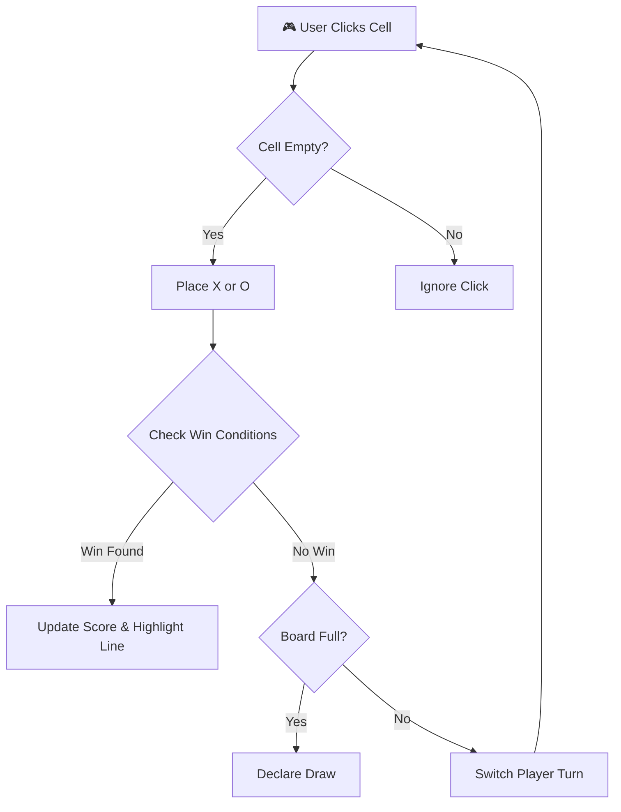

<div align="center">
  

  # 🎮 Tic-Tac-Toe — Classic Web Game

  **A beautifully designed, responsive, and interactive Tic-Tac-Toe web experience.**

  [](https://developer.mozilla.org/en-US/docs/Glossary/HTML5)
  [](https://developer.mozilla.org/en-US/docs/Web/CSS)
  [](https://developer.mozilla.org/en-US/docs/Web/JavaScript)
  [](LICENSE)

  > *"Simple to learn, impossible to master."* — Enjoy the classic game of Xs and Os anywhere, on any device.
</div>

---

<details open>
  <summary><b>📑 Table of Contents</b></summary>
  <ol>
    <li><a href="#-play-online">Play Online</a></li>
    <li><a href="#-problem-statement">Problem Statement</a></li>
    <li><a href="#-where-is-it-used-use-cases">Where is it Used?</a></li>
    <li><a href="#-features--capabilities">Features & Capabilities</a></li>
    <li><a href="#%EF%B8%8F-how-everything-works-in-depth">How Everything Works</a></li>
    <li><a href="#-tech-stack--libraries">Tech Stack</a></li>
    <li><a href="#-project-architecture">Architecture</a></li>
    <li><a href="#-getting-started">Getting Started</a></li>
    <li><a href="#-usage-instructions">Usage Instructions</a></li>
    <li><a href="#-acknowledgements">Acknowledgements</a></li>
  </ol>
</details>

---

## 🌐 Play Online

No installation is required. The game is hosted securely online and can be accessed directly at the link below:

### 👉 **[Play Tic-Tac-Toe Game Here!](https://playtictactoehere.netlify.app/)**

---

## 📺 Demo Preview

<div align="center">
  <!-- Use your custom image here if preferred -->
  
  <br>
  <i>"A visually appealing classic game interface that scales perfectly on any screen."</i>
</div>

---

## 🎯 Problem Statement

Traditional games remain some of the best exercises for cognitive development, yet physical board games aren't always accessible when you have a free moment.

This **Tic-Tac-Toe** web project solves that by bringing the classic pen-and-paper game into the digital era with a seamless, responsive layout that works entirely inside the browser without downloading any apps.

---

## 🌍 Where is it Used? (Use Cases)

<table align="center">
  <tr>
    <td align="center" width="25%">
      
      <br /><b>Casual Entertainment</b><br />Quick matches to pass the time with a friend on a single device.
    </td>
    <td align="center" width="25%">
      
      <br /><b>Mobile Gaming</b><br />A fully responsive interface makes it an excellent choice for gaming on smartphones or tablets.
    </td>
    <td align="center" width="25%">
      
      <br /><b>Educational Resource</b><br />A foundational web development project for modern HTML, CSS grids, and JavaScript DOM manipulation.
    </td>
  </tr>
</table>

---

## ✨ Features & Capabilities

Our game comes packed with standard and interactive capabilities:

| Category | Actions / Features |
|----------|--------------------|
|  **Responsive Design** | Adapts dynamically to desktop, tablet, and mobile screens for an optimal experience. |
|  **Score Tracking** | Keeps an ongoing score count for both Player 1 (X) and Player 2 (O). |
|  **Interactive Gameplay** | Smooth DOM manipulation for alternating marks and responsive hover states. |
|  **Win/Draw Detection** | Accurately identifies 3-in-a-row connections and full-board stalemates instantly. |
|  **Reset Functionality** | One-click button allows players to reset the game board or scores and start fresh. |

---

## ⚙️ How Everything Works in Depth

The project leverages event-driven JavaScript to provide a fast and snappy interface.

1. **Initialization**: The script links up with the HTML grid elements and attaches "click" event listeners.
2. **Turn Management**: An internal state boolean switches between Player X and Player O.
3. **Validation**: Before placing a mark, JS verifies that the specific square is unchecked.
4. **Win Condition Check**: An array of 8 winning combinations is verified after every move.
5. **UI Update**: CSS classes are toggled dynamically to show who won, and the score board is incremented.



---

## 🛠️ Tech Stack & Libraries

We rely on core web vanilla technologies for maximum performance without external framework bloat:

<table align="center">
  <tr>
    <td align="center"><br>Structure & Grid</td>
    <td align="center"><br>Styling & Responsive UI</td>
    <td align="center"><br>Game Logic & DOM</td>
  </tr>
</table>

---

## 🧱 Project Architecture

The codebase relies on a simple, clean static structure separated by structural concerns:

```text
Tic-Tac-Toe-Game/
├── index.html         # Main layout container and game structure
├── README.md          # Project documentation
├── Scripts/
│   └── game.js        # Core logic, DOM manipulation, turn management
└── Styles/
    └── game.css       # Visual styling for the board, UI, and mobile responsiveness
```

---

## 🚀 Getting Started

If you wish to test or host it locally:

### 1️⃣ Prerequisites
- Modern web browser (Chrome, Firefox, Safari, Edge).
- Basic code editor (VS Code, Sublime Text).

### 2️⃣ Installation & Setup

```bash
# Clone the repository
git clone https://github.com/yourusername/Tic-Tac-Toe-Game.git
cd Tic-Tac-Toe-Game

# Double click/open the file in your browser
# (or use VS Code Live Server for hot reload)
open index.html
```

---

## 🕹️ Usage Instructions

To play the game directly, visit the [Live Deployment](https://playtictactoehere.netlify.app/).

1. **Game Start**: The game typically defaults to Player X's turn first.
2. **Taking Turns**: Players take turns clicking on empty squares on the 3x3 grid to place their markers.
3. **Winning**: Match three respective symbols (X or O) horizontally, vertically, or diagonally.
4. **Drawing**: If all 9 squares are filled and no one has connected 3, the game announces a Draw.
5. **Resetting**: Use the integrated Reset button to clear the board and begin a new round!

---

## 🙏 Acknowledgements

*   **Author:** Chaitanya Wagh
*   **Mission:** This project was developed by Chaitanya Wagh to create a visually impressive, yet beautifully simple web game suitable for people of all ages.
*   Special thanks to the HTML5/CSS3/JS open source community for endless tutorials and inspiration.

<br>

<div align="center">
  
  <br>
  <h2><b>Thank You For Checking Out The Game!</b></h2>
  <p><i>Made with passion and creativity. Enjoy the matches!</i></p>
  
</div>

